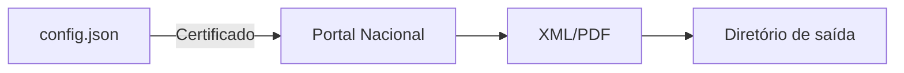

# Baixar NFS-e Portal Nacional

Ferramenta em **Python** para automatizar o download de Notas Fiscais de Serviço (NFS-e) diretamente do Portal Nacional, salvando XML e PDF com praticidade.

[](https://github.com/USERNAME/baixar_nfse_portal_nacional/actions/workflows/build_exe.yml)
[](LICENSE)

## Baixe o executável

Sempre que mudanças são enviadas para o branch `main` o projeto gera
automaticamente um arquivo `exe` através do GitHub Actions. Você pode
obter a versão mais recente acessando a página de releases e baixando o
executável disponível.

[Download do instalador](https://github.com/USERNAME/baixar_nfse_portal_nacional/releases/latest)

## Visão geral

O projeto simplifica a obtenção de notas fiscais eletrônicas emitidas pelo Portal Nacional da NFS-e. Ideal para empresas e contadores que precisam manter o arquivo de notas organizado sem acessar manualmente o site.

### Principais recursos

- Baixa automaticamente XML e PDFs das notas.
- Armazena logs e permite retomar o processo pelo último NSU.
- Utiliza certificado digital (PFX ou PEM) para autenticação.
- Possui interface gráfica simples construída com `tkinter`.
- Suporte a criação de executável standalone via PyInstaller.

### Fluxo de funcionamento



## Instalação

1. Tenha o **Python 3.10** ou superior instalado.
2. (Opcional) Crie um ambiente virtual:

```bash
python3 -m venv .venv
source .venv/bin/activate  # Windows: .venv\Scripts\activate
```

3. Instale as dependências:

```bash
pip install -r requirements.txt
```

## Configuração

Edite o arquivo `config.json` (gerado automaticamente caso não exista) com as seguintes chaves:

- `cert_path`: caminho do certificado digital.
- `cert_pass`: senha do certificado.
- `cnpj`: CNPJ utilizado no portal.
- `output_dir`: pasta onde os XMLs serão salvos.
- `log_dir`: diretório de logs.
- `file_prefix`: prefixo dos arquivos.
- `download_pdf`: `true` para baixar também o PDF.
- `delay_seconds`: intervalo entre consultas.
- `auto_start`: inicia o download ao abrir.
- `timeout`: tempo limite das requisições.

## Uso

Execute o script principal:

```bash
python download_nfse.py
```

O programa inicia a interface gráfica e começa a baixar as notas de acordo com as configurações. Os arquivos são gravados seguindo o padrão `<prefixo>_AAAA-MM_<chave>.xml`.

## Contribuição

Contribuições são bem-vindas! Abra issues ou pull requests com melhorias, correções ou novas funcionalidades. Para mudanças maiores, discuta previamente através de uma issue.

## Licença

Distribuído sob a licença [MIT](LICENSE).

## Contato

Para dúvidas ou suporte abra uma issue no GitHub ou contate **Renan R. Santos** através do [LinkedIn](https://www.linkedin.com/).

## Documentação online

Você pode publicar a pasta `docs/` via **GitHub Pages** para hospedar uma documentação completa em <https://USERNAME.github.io/baixar_nfse_portal_nacional/>.

## Dados estruturados

```html
<script type="application/ld+json">
{
  "@context": "https://schema.org",
  "@type": "SoftwareApplication",
  "name": "Baixar NFS-e Portal Nacional",
  "applicationCategory": "BusinessApplication",
  "operatingSystem": "Windows, Linux, macOS",
  "license": "https://opensource.org/licenses/MIT",
  "offers": {
    "@type": "Offer",
    "price": "0",
    "priceCurrency": "BRL"
  }
}
</script>
```

---

### Tópicos sugeridos

Adicione as seguintes *tags* ao repositório no GitHub para melhorar a descoberta:
`nfse`, `nfs-e`, `portal-nacional`, `download`, `python`, `automacao`, `xml`, `pdf`.

